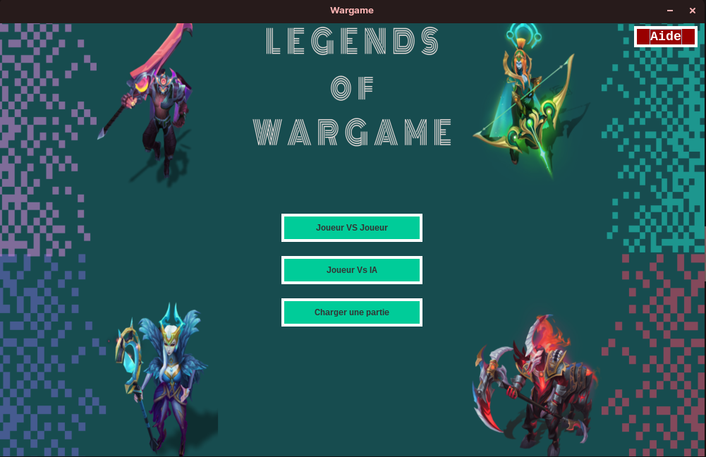
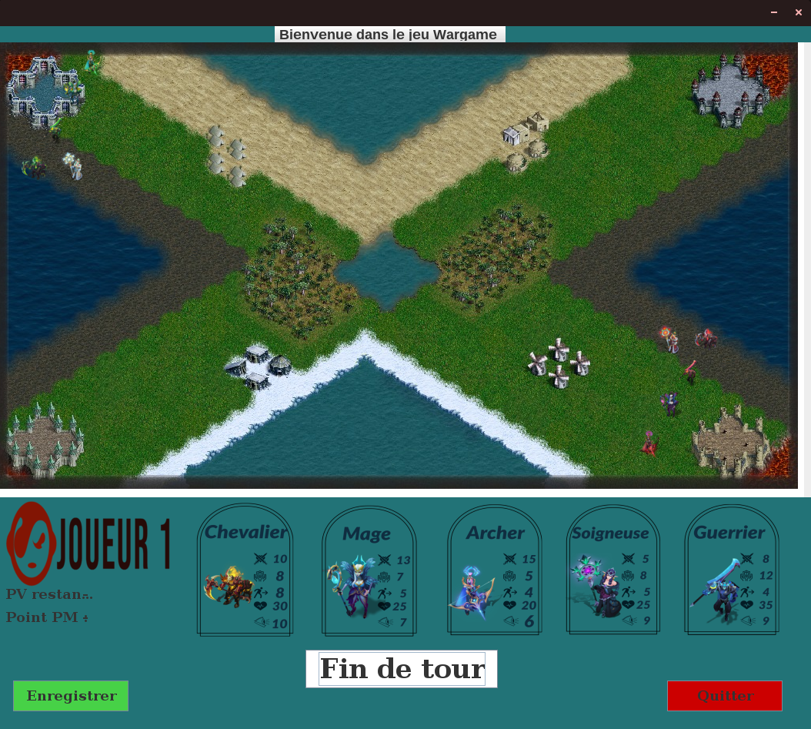
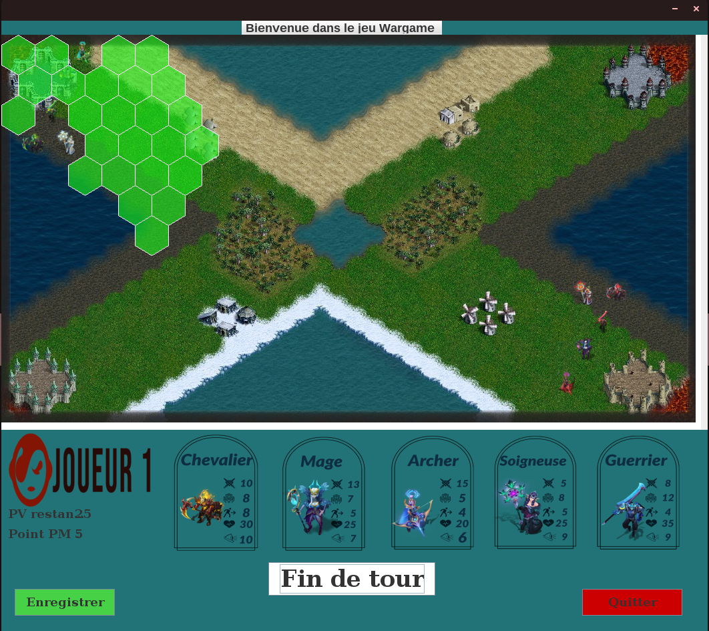
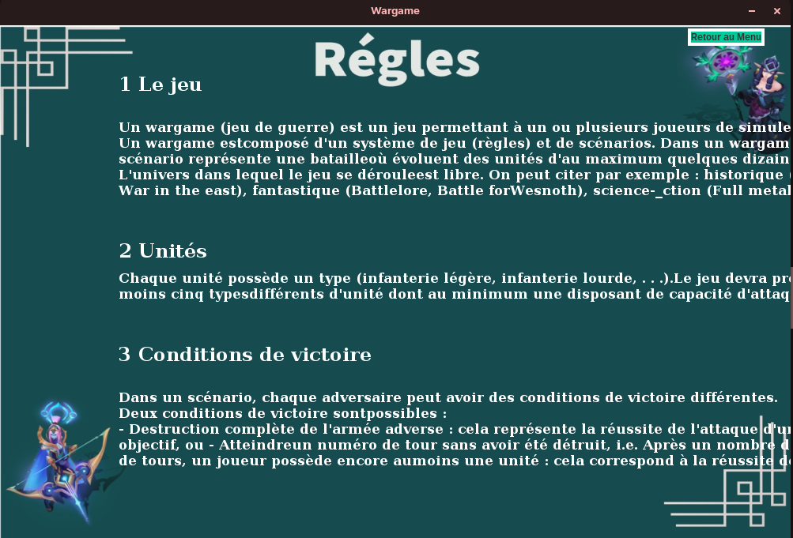
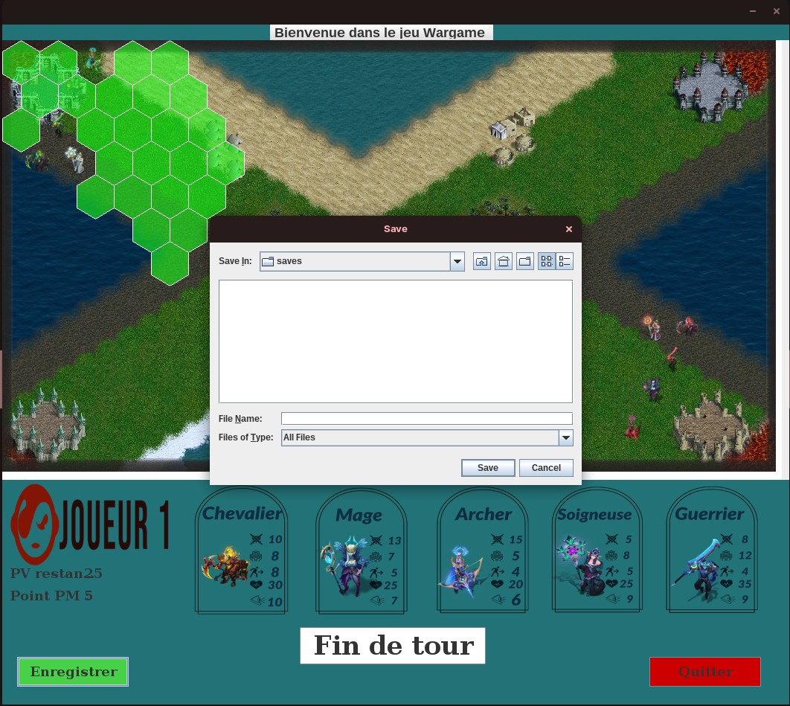

# Wargame

A 2D **turn-based strategy game** on a hexagonal grid, written in **Java (Swing)**
with an **MVC** architecture. Lead an army of five unit types across varied terrain,
manage fog of war, and eliminate your opponents — locally against other players or
against the AI.


---

## Screenshots

| Main menu | Game board |
|:---:|:---:|
|  |  |
| The main menu (Player vs Player, Player vs AI, Help). | A game in progress on the hexagonal board. |

| Movement range | Help / rules |
|:---:|:---:|
|  |  |
| Selecting a unit highlights its reachable hexes (green) and targets (red). | The in-game help describing the rules. |



*Saving the current game from the board screen.*

## Overview

The game is played on a 12×20 hexagonal board. Each player starts with five units.
On your turn, select a unit to reveal its reachable hexes (movement) and targets
(attack/heal), act, then end your turn. The last player with units standing wins.

- **Game modes**: Player vs Player (2–4 players) and Player vs AI (several
  human/AI combinations).
- **Fog of war**: each unit reveals hexes within its vision range.
- **Terrain** affects movement cost and defense.
- **AI opponents** that seek targets, attack in range, heal allies, and reposition.

## Units

| Unit | Attack | Defense | HP | Move | Vision | Range |
|------|:------:|:-------:|:--:|:----:|:------:|:-----:|
| Guerrier (Warrior)   |  8 | 12 | 35 | 4 |  9 | 1 |
| Archer               | 15 |  5 | 20 | 4 |  6 | 3 |
| Chevalier (Knight)   | 10 |  8 | 30 | 6 | 10 | 1 |
| Mage                 | 13 |  7 | 25 | 5 |  7 | 2 |
| Soigneuse (Healer)   |  5 |  8 | 25 | 5 |  9 | 1 |

The healer restores 30% of an ally's max HP instead of attacking. Damage also
depends on terrain defense bonus and a random factor.

## Terrain

| Terrain | Defense bonus | Move cost |
|---------|:-------------:|:---------:|
| Plaine (Plain)  | +10% | 1 |
| Village         | +30% | 1 |
| Forêt (Forest)  | +50% | 2 |
| Lac (Lake)      | +10% | 2 |
| Désert (Desert) | +10% | 2 |
| Neige (Snow)    | +70% | 3 |
| Mer (Sea)       |   —  | impassable |

## Controls

- **Click a unit** to select it — reachable hexes are highlighted in green,
  enemies in range in red.
- **Click a highlighted hex** to move there; **click an enemy in range** to attack;
  with the healer, **click an ally** to heal.
- **Fin de tour** ends your turn · **Enregistrer** saves · **Quitter** leaves the game.

## Project structure

```
wargame/
├── src/
│   ├── modele/       # domain: Unite (+ Archer, Chevalier, Guerrier, Mage, Soigneuse),
│   │                 #         Hexagone, Joueur, Humain, IA, CleMap
│   ├── vue/          # Swing views: MainJFrame, MenuPrincipal, IHMPlateau,
│   │                 #              CustomPanel, PaintImage, Aide, VictoireFrame
│   └── controleur/   # LogiqueJeu (game engine), Main (entry point)
├── assets/           # images/ and musique/  (see assets/README.md)
├── saves/            # saved games
├── pom.xml
└── docs/screenshots/
```

## Build & run

Requires **JDK 17+**. Media files must be present under `assets/` (see
[`assets/README.md`](assets/README.md)). Run from the **project root** so the
relative asset paths resolve.

**Recommended — compile with Maven, then launch directly:**

```bash
mvn compile
java -cp target/classes controleur.Main
```

Or with plain `javac` / `java`:

```bash
javac -encoding UTF-8 -d bin $(find src -name "*.java")
java -cp bin controleur.Main
```

The entry point is `controleur.Main`, which opens the main menu and starts the
background music.

> **Run it on the main thread.** Launch the game with `java` (as above), not with
> `mvn exec:java`. The turn loop and Swing's event thread coordinate through shared
> state, and running `main()` on the real main thread (like `java` or an IDE's Run
> button does) is what makes clicks, movement highlighting and moves behave
> correctly. `mvn exec:java` runs `main()` on a worker thread and can leave the
> board unresponsive.
>
> The shared click flags are also declared `volatile` for correct cross-thread
> visibility.

## Known limitations

This is a student project. A few
things worth knowing, and good candidates for future work:

- **Static engine**: `LogiqueJeu` is an all-static "god object" and the model
  depends on the controller — the MVC separation is loose.
- **Turn handling uses busy-wait loops** (spin-waiting on click flags) rather than
  an event-driven model. The shared flags are now `volatile` so this works
  reliably across threads, but an event-driven design would be cleaner.
- **Rendering reloads images from disk on every repaint** in `IHMPlateau`, which is
  wasteful; sprites could be cached once.
- **Save/Load is incomplete**: the text save writes raw code points via
  `FileWriter.write(int)` and “Charger une partie” is not wired up, so saved games
  can't be reliably reloaded yet.
- **Map terrain is hard-coded** by coordinates in `initMap()`.

## License

Released under the [MIT License](LICENSE).
